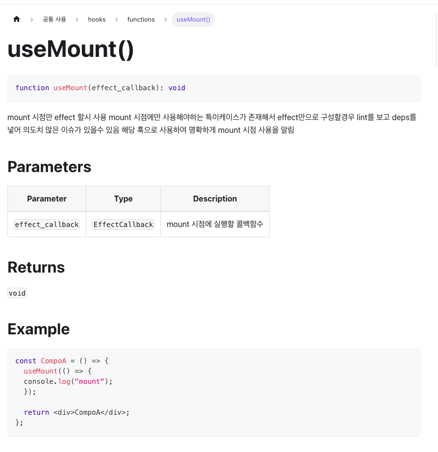
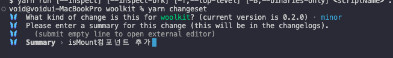
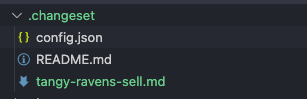
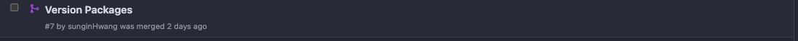

# Monolith 작업 가이드

## 1. 패키지 코드 작성 
우선 작업해야할 `Hook`, `Component`, `Util`, `Constant` 파일을 만들어 작업합니다.
본 예시에서는 `useMount` hook을 추가하는 예시로 설명합니다. 또한 모든 `Hook`, `Component`, `Util` 에는 *단위테스트가 필수로 요구됩니다.*
단위테스트가 제대로 구성되어있지 않거나 없는경우 PR 반려사유이기 때문에 꼼꼼한 테스트 진행 부탁드립니다. 
또한 단위테스트는 되도록 `when given then` 가 잘 이루어지도록 작성하여야 합니다.

```
 테스트 파일은 작업 경로파일에 동일한 위치에 {파일명}.test.ts 로 작성합니다.
```

```tsx
//hooks/useMount.ts
import { type EffectCallback, useEffect } from 'react';

export const useMount = (effect_callback: EffectCallback) => {
  useEffect(effect_callback, []);
};

//hooks/useMount.test.ts
import { renderHook } from "@testing-library/react";
import { useMount } from "./useMount";

describe("useMount", () => {
  it("useEffect 함수는 마운트시 의존성에 상관없이 한번만 렌더링 되어야 합니다.", () => {
    const effectCallback = vi.fn(); 
    
    const { unmount, rerender } = renderHook(() => useMount(effectCallback));

    expect(effectCallback).toHaveBeenCalledTimes(1);

    rerender(); 
    expect(effectCallback).toHaveBeenCalledTimes(1);

    unmount(); 
    expect(effectCallback).toHaveBeenCalledTimes(1);
  });
});

```

## 2. TsDoc 작성 
`Monolith` 의 문서는 TsDoc 을 기반으로 자동생성하는 `typedoc` + `docusaurus` 의 조합으로 구성되어 있기 때문에 필수로 작성해야 합니다.
또한 작성되어있으면 해당 패키지를 쓰는 입장에서 빠르게 파악이 가능하다는 추가장점도 존재합니다. 때문에 최대한 자세하게 기술 하도록 합니다.

필수로 작성해야하는 `tsdoc` 종류는 다음과 같습니다.
* params (어떤 props를 쓰는지는 필수로 제공해야 합니다.)
* description (어떠한 함수,훅 인지 빠르게 알기 위해 필수로 작성합니다. 다만 문서에서 제일 위에서 설명을 볼수 있도록 하기 위해 @description이 아닌 최상단에만 기입합니다 )
* example (가장 빠르게 이해하는 수단은 예시 샘플 입니다. 단순하게 한개만 적는것이 아닌 큰 엣지케이스들을 전부 작성해 주세요.)

위의 필수값을 `isMounted` 훅 예시로 만들면 다음과 같이 볼 수 있습니다.

```tsx
//hooks/useMount.ts
import { type EffectCallback, useEffect } from 'react';

/**
 * mount 시점만 effect 할시 사용
 * mount 시점에만 사용해야하는 특이케이스가 존재해서 effect만으로 구성할경우 lint를 보고 deps를 넣어 의도치 않은 이슈가 있을수 있음
 * 해당 훅으로 사용하여 명확하게 mount 시점 사용을 알림
 * @param effect_callback - mount 시점에 실행할 콜백함수
 * 
 * @example
 * ```typescript
 * const CompoA = () => {
 *   useMount(() => {
 *   console.log("mount");  
 *   });
 * 
 *   return <div>CompoA</div>;
 * };
 * ```
 */
export const useMount = (effect_callback: EffectCallback) => {
  useEffect(effect_callback, []);
};
```

이렇게 작성후 자동생성되는 문서를 확인하면 다음과 같이 만들어지는것을 확인할 수 있습니다.




## 3. changeset 적용하기
`Monolith` 패키지의 버전관리는 `changeset` 통한 자동화가 되어있습니다. 
작업이 마무리되었다면 아래 명령어를 입력하여 *작업한 변경사항을 적어주도록 합니다.*

> yarn changeset

이후 아래 이미지처럼 배포내역을 작성한위 확인을 눌러주도록 합니다.



그러면 아래와 같이 `.changeset`에 버전반영된 파일이 추가된것을 볼수 있습니다. 해당파일까지 같이 commit 후 `main` 에 PR 요청을 합니다.




## 4. 패키지 배포
PR이 승인 되어 main 브랜치에 머지가 된 이후 자동으로 패키지배포용 PR이 생성됩니다. 



해당 PR을 **머지하게 되면 자동적으로 변경사항(CHANGELOG.md) 및 패키지 배포**가 이루어집니다.!


## 5. 문서 배포
작성해야 합니다.
